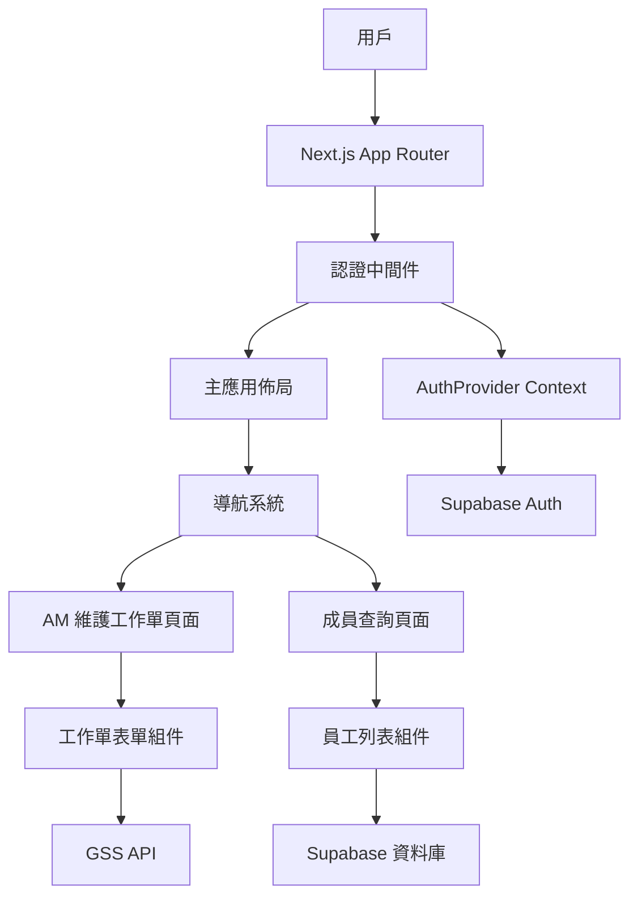
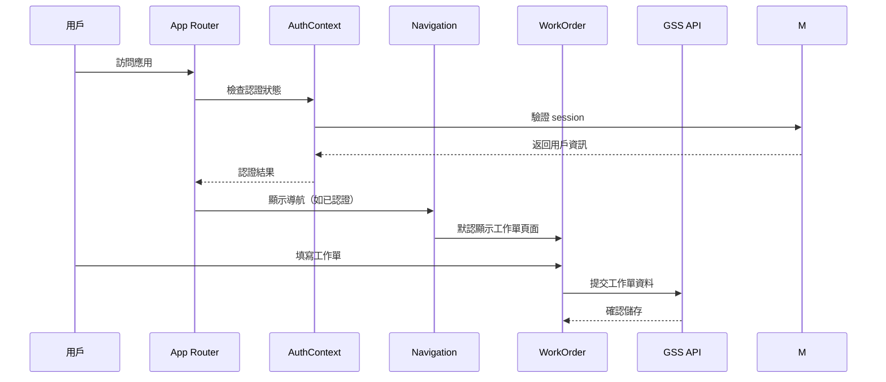

# Design Document

## Overview

AM 維護工作單系統將整合到現有的 Next.js 13 應用中，使用 App Router 架構。系統將擴展現有的員工管理功能，添加 AM 維護工作單填寫和管理功能。設計採用模組化架構，重用現有的認證系統、UI 組件庫（shadcn/ui + Radix UI）並整合現有的設計系統。系統將保持與 GSS API 的連接，同時提供完整的 React 化用戶體驗。

## Architecture

### 技術棧
- **前端框架**: Next.js 13 (App Router)
- **UI 框架**: React 18 + TypeScript
- **樣式**: 現有設計系統 + Tailwind CSS + shadcn/ui 組件庫
- **狀態管理**: React Context API (現有的 AuthProvider)
- **後端服務**: GSS API (現有) + Supabase (認證)
- **表單處理**: React Hook Form + Zod 驗證
- **圖標**: FontAwesome + Lucide React
- **日期處理**: 原生 HTML5 date input + date-fns

### 系統架構圖



### 資料流架構



## Components and Interfaces

### 1. 簡化的項目目錄結構

```
project/
├── app/                          # Next.js App Router (僅全局配置)
│   ├── layout.tsx               # 全局佈局和 AuthProvider
│   └── page.tsx                 # 根路由（認證和路由管理）
├── pages/                        # 頁面組件目錄
│   ├── work-order-page.tsx      # AM 維護工作單頁面
│   └── employees-page.tsx       # 員工查詢頁面
├── components/                   # 可重用組件目錄
│   ├── layout/                  # 佈局相關組件
│   │   ├── main-layout.tsx      # 主應用佈局
│   │   ├── navigation.tsx       # 導航欄組件
│   │   └── page-container.tsx   # 頁面容器組件
│   ├── work-order/              # 工作單相關組件
│   │   ├── work-order-form.tsx  # 工作單表單
│   │   └── work-order-response.tsx # 提交回應組件
│   ├── employees/               # 員工查詢相關組件
│   │   ├── employee-search.tsx  # 員工搜尋組件
│   │   └── employee-list.tsx    # 員工列表組件
│   └── router/                  # 路由相關組件
│       ├── app-router.tsx       # 應用路由管理器
│       └── route-guard.tsx      # 認證守衛組件
├── lib/                         # 工具函數和服務
│   ├── gss-api.ts              # GSS API 服務
│   ├── router.ts               # 路由配置和導航邏輯
│   └── schemas/                # 驗證 schemas
└── styles/                      # 樣式文件
    └── design-system.css       # 整合的設計系統
```

### 2. 簡化的架構設計原則

#### App Router (app/)
- **職責**: 僅處理全局配置、認證提供者、根路由
- **特點**: 不包含具體頁面邏輯，只負責應用初始化和路由分發
- **文件**: `layout.tsx`（全局佈局）、`page.tsx`（根路由和認證檢查）

#### 頁面組件 (pages/)
- **職責**: 處理完整的頁面邏輯、狀態管理、資料獲取
- **特點**: 獨立的頁面組件，通過路由管理器調用
- **命名**: 以 `-page.tsx` 結尾，清楚標識為頁面組件

#### 路由管理 (components/router/)
- **職責**: 處理頁面間導航、認證守衛、路由狀態管理
- **特點**: 集中管理所有路由邏輯，提供統一的導航介面
- **組件**: `app-router.tsx`（路由管理器）、`route-guard.tsx`（認證守衛）

#### 功能組件 (components/)
- **職責**: 可重用的 UI 組件，專注於特定功能
- **特點**: 接收 props，無狀態或局部狀態，可測試性強
- **組織**: 按功能領域分組（layout/, work-order/, employees/, router/）

### 3. 核心組件詳細設計

#### App Router 組件 (components/router/app-router.tsx)
```typescript
interface AppRouterProps {
  user: User | null;
  onLogout: () => void;
}

// 負責：
// - 管理當前頁面狀態
// - 處理頁面間導航
// - 整合認證守衛
// - 渲染對應的頁面組件
```

#### Route Guard 組件 (components/router/route-guard.tsx)
```typescript
interface RouteGuardProps {
  user: User | null;
  children: React.ReactNode;
  requireAuth?: boolean;
}

// 負責：
// - 檢查用戶認證狀態
// - 保護需要認證的頁面
// - 處理未認證用戶的重定向
```

#### WorkOrderPage 組件 (pages/work-order-page.tsx)
```typescript
interface WorkOrderPageProps {
  onNavigate: (route: string) => void;
}

// 負責：
// - 工作單頁面的完整邏輯
// - 表單狀態管理
// - GSS API 整合
// - 錯誤處理和載入狀態
```

#### EmployeesPage 組件 (pages/employees-page.tsx)
```typescript
interface EmployeesPageProps {
  onNavigate: (route: string) => void;
}

// 負責：
// - 員工查詢頁面邏輯
// - 員工資料管理
// - 搜尋和篩選狀態
```

#### 路由配置 (lib/router.ts)
```typescript
export const ROUTES = {
  WORK_ORDER: 'work-order',
  EMPLOYEES: 'employees',
} as const;

export type RouteKey = typeof ROUTES[keyof typeof ROUTES];

export interface RouteConfig {
  key: RouteKey;
  title: string;
  requireAuth: boolean;
  component: React.ComponentType<any>;
}

export const routeConfigs: RouteConfig[] = [
  {
    key: ROUTES.WORK_ORDER,
    title: '工作單填寫',
    requireAuth: true,
    component: WorkOrderPage,
  },
  {
    key: ROUTES.EMPLOYEES,
    title: '成員查詢',
    requireAuth: true,
    component: EmployeesPage,
  },
];
```

### 2. 資料模型

#### AM 維護工作單資料模型
```typescript
export interface WorkOrderPayload {
  actNo: null;
  actTypeId: "Be";
  custNo: "GSS";
  caseContNo: "O202502047";
  prdPjtNo: "內部專案-2025020600007 - Vital  Casebridge產品計畫書_2025年";
  ttlHours: 8;
  isPrnToCust: "Be099";
  attachFileName: null;
  isAttachFile: "00200";
  isPrdOrPjt: "J";
  message: null;
  status: false;
  favoriteContOppId: "7016";
  suppDeptItems: "U236";
  sdateTime: string; // 格式: "YYYY-MM-DDTHH:mm:ss.sssZ"
  edateTime: string; // 格式: "YYYY-MM-DDTHH:mm:ss.sssZ"
  description: string;
}

export interface WorkOrderFormData {
  workDate: string; // ISO date string (YYYY-MM-DD)
  description: string;
}

export interface WorkOrderResponse {
  success: boolean;
  message?: string;
  error?: string;
}
```

### 3. API 介面設計

#### GSS API 配置
```typescript
// lib/gss-api.ts
export const GSS_API_CONFIG = {
  url: 'https://assistant.gss.com.tw/AMApi/AMMaintainWeb/InsertData/AMMaintainWeb',
  headers: {
    'User-Agent': 'Mozilla/5.0 (Windows NT 10.0; Win64; x64) AppleWebKit/537.36',
    'Accept': 'application/json, text/plain, */*',
    'Content-Type': 'application/json',
    'Authorization': 'Bearer [TOKEN]',
    'accept-language': 'zh-TW,zh;q=0.9,en-US;q=0.8,en;q=0.7',
    'origin': 'https://assistant.gss.com.tw',
    'referer': 'https://assistant.gss.com.tw/am/',
    // ... 其他必要的 headers
  }
};

export class WorkOrderService {
  static async submitWorkOrder(formData: WorkOrderFormData): Promise<WorkOrderResponse>;
  static formatDateTime(date: string, timeStr: string): string;
  static createPayload(formData: WorkOrderFormData): WorkOrderPayload;
}
```

## Data Models

### 1. 表單驗證 Schema

```typescript
// lib/schemas/work-order.ts
import { z } from 'zod';

export const workOrderSchema = z.object({
  workDate: z.string().min(1, '請選擇工作日期'),
  description: z.string()
    .min(5, '工作描述至少需要5個字符')
    .max(1000, '工作描述不能超過1000個字符'),
});

export type WorkOrderFormData = z.infer<typeof workOrderSchema>;
```

### 2. 設計系統整合

#### CSS 變數系統
```typescript
// styles/design-system.ts
export const DESIGN_TOKENS = {
  colors: {
    primary: 'var(--color-primary)',
    primaryHover: 'var(--color-primary-hover)',
    surface: 'var(--color-surface)',
    text: 'var(--color-text)',
    error: 'var(--color-error)',
    success: 'var(--color-success)',
    // ... 其他色彩變數
  },
  spacing: {
    xs: 'var(--space-4)',
    sm: 'var(--space-8)',
    md: 'var(--space-16)',
    lg: 'var(--space-24)',
    xl: 'var(--space-32)',
  },
  radius: {
    sm: 'var(--radius-sm)',
    base: 'var(--radius-base)',
    lg: 'var(--radius-lg)',
  }
};
```

## Error Handling

### 1. 錯誤類型定義

```typescript
// lib/errors.ts
export class WorkOrderError extends Error {
  constructor(
    message: string,
    public code: string,
    public statusCode: number = 400
  ) {
    super(message);
    this.name = 'WorkOrderError';
  }
}

export const ERROR_CODES = {
  NETWORK_ERROR: 'NETWORK_ERROR',
  API_ERROR: 'API_ERROR',
  VALIDATION_ERROR: 'VALIDATION_ERROR',
  CORS_ERROR: 'CORS_ERROR',
  UNAUTHORIZED: 'UNAUTHORIZED',
} as const;
```

### 2. 錯誤處理策略

- **表單驗證錯誤**: 即時顯示在表單欄位下方，輸入改變時自動清除
- **網路錯誤**: 使用回應訊息組件顯示，提供重試選項
- **API 錯誤**: 顯示 HTTP 狀態碼和錯誤訊息
- **CORS 錯誤**: 特別提醒用戶關於跨域政策限制
- **未預期錯誤**: 顯示通用錯誤訊息，記錄到控制台

## Testing Strategy

### 1. 單元測試

#### 測試範圍
- **組件測試**: 使用 React Testing Library
  - 工作單表單組件的渲染和互動
  - 導航組件的路由切換
  - 錯誤處理和載入狀態

- **服務層測試**: 使用 Jest
  - WorkOrderService 的 API 調用
  - 表單驗證 schema
  - 日期格式化邏輯

#### 測試工具
- **測試框架**: Jest + React Testing Library
- **模擬**: MSW (Mock Service Worker) 用於 GSS API 模擬
- **覆蓋率**: Jest coverage reports

### 2. 整合測試

#### 測試場景
- **認證流程**: 登入 → 導航 → 工作單頁面
- **工作單流程**: 填寫 → 提交 → 成功回應
- **員工查詢**: 搜尋 → 篩選 → 查看詳情

## Implementation Phases

### Phase 1: 設計系統整合
1. 將現有 CSS 設計系統整合到 Tailwind CSS
2. 建立設計 token 對應
3. 設置導航系統

### Phase 2: 工作單功能實作
1. 工作單表單組件
2. GSS API 整合
3. 錯誤處理和載入狀態

### Phase 3: 員工查詢重構
1. 重構現有員工查詢頁面
2. 整合到新的導航系統

### Phase 4: 優化和測試
1. 響應式設計優化
2. 效能優化
3. 測試覆蓋率提升

## Security Considerations

### 1. API 安全
- 保護 GSS API 的 Authorization token
- 實作適當的 CORS 處理
- 驗證所有用戶輸入

### 2. 認證和授權
- 重用現有的 Supabase 認證系統
- 確保只有已認證用戶能存取工作單功能

## Performance Optimization

### 1. 前端優化
- **代碼分割**: 按頁面分割 JavaScript bundle
- **懶載入**: 非關鍵組件延遲載入
- **表單優化**: 使用 React Hook Form 減少重新渲染

### 2. 使用者體驗優化
- **載入狀態**: 提供視覺載入指示器
- **即時驗證**: 表單欄位即時驗證反饋
- **響應式設計**: 確保在所有設備上的良好體驗
- **自動調整**: 文字區域自動調整大小

## Design System Integration

### 1. 色彩系統
- 保持現有的淺色/深色主題支援
- 使用 CSS 變數確保主題一致性
- 整合狀態色彩（成功、錯誤、警告）

### 2. 組件樣式
- 重用現有的按鈕、表單、卡片樣式
- 保持一致的焦點狀態和互動效果
- 使用現有的動畫和過渡效果

### 3. 響應式設計
- 保持現有的斷點系統
- 確保行動版的適當邊距和間距
- 優化觸控互動體驗